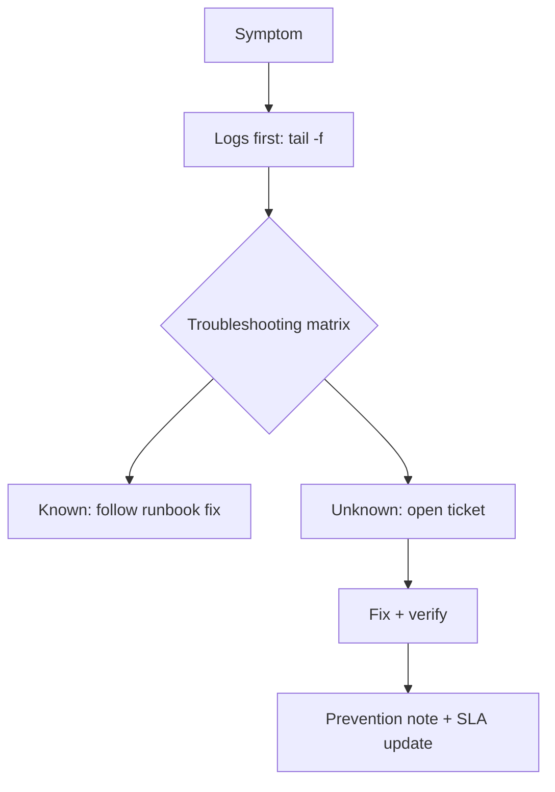

# lifeos-ops

Operasional [LifeOS](https://github.com/RakhaYandra/lifeos): runbook,
skrip backup/restore teruji, troubleshooting matrix (perintah terverifikasi),
10 tiket simulasi + XLSX, SLA mini, FAQ.

## Purpose, Output & Expectations

**Purpose.** A local-first app still fails: disks fill, secrets rotate,
users forget passwords, restores are needed at the worst time. This repo is
the operations manual that keeps LifeOS alive — every command verified by
actually running it.

**Output.** A runbook (install → backup → restore → restart), tested
backup/restore scripts with rotation and guards, a 15-entry troubleshooting
matrix with real outputs, 10 support tickets (2 from real incidents), an SLA,
and an FAQ.

**Expectations.** After reading: any listed symptom resolves by following the
matrix; backup→wipe→restore roundtrip is proven (25 tasks + 19 goals back);
ticket format is reusable for real incidents.

## Features

| Feature | Description |
|---|---|
| Runbook | - Install, `.env`, migrate+seed, backup/restore/reset/restart, login checklist. - Purpose: one place for operations. Output: COPY-pasteable commands. |
| Backup scripts | - Timestamped SQLite copies + 7-day rotation; restore refuses while API runs. - Purpose: survive data loss. Output: proven roundtrip. |
| Troubleshooting | - 15 entries: symptom → diagnosis → verified command → healthy output. - Purpose: log first, guess later. Output: 15/15 commands run. |
| Tickets | - 10 tickets (severity, timeline, diagnosis, resolution, prevention) incl. 2 real incidents (CORS, restore). - Purpose: support process on paper. Output: `LifeOS-Tickets.xlsx` with SLA COUNTIF. |
| SLA + FAQ | - Severity targets, escalation, and user-facing answers. - Purpose: set expectations. Output: agreed targets. |

## How It Works



## Isi

```
RUNBOOK.md          # install, .env, backup/restore/reset/restart, checklist login
scripts/            # lifeos-backup.sh + lifeos-restore.sh (rotasi 7, guard API)
TROUBLESHOOTING.md  # 15 entri: gejala → diagnosis → perintah (terverifikasi)
tickets.yaml        # 10 tiket simulasi (2 insiden nyata: CORS, restore)
tools/build_tickets.py -> LifeOS-Tickets.xlsx (cover, tiket, SLA COUNTIF + pie)
SLA.md, FAQ.md
```

## Bukti uji

* Roundtrip: backup → hapus tasks (0) → restore → 25 tasks + 19 goals kembali
* Guard restore menolak saat API jalan
* 15 perintah matrix dijalankan (output tercatat di commit message run)
